# YOLOv5를 이용한 쓰레기 분류

본 프로젝트는 **YOLOv5 객체 탐지 기술**을 활용하여 다양한 쓰레기를 자동으로 인식하고 분류하는 시스템을 구현한 연구입니다. 재활용을 촉진하고 환경 오염을 줄이기 위한 목적으로 개발되었습니다.

## 🧠 프로젝트 개요

- **목적**: 쓰레기 자동 분류를 통해 재활용 효율 향상 및 환경 보호
- **기술**: YOLOv5 (PyTorch 기반 실시간 객체 탐지 모델)
- **데이터셋**: [AIHub 생활 폐기물 이미지 데이터 (총 15종 중 5종 사용)](https://www.aihub.or.kr/aihubdata/data/view.do?currMenu=115&topMenu=100&aihubDataSe=data&dataSetSn=140)
- **분류 대상**: 비닐류, 유리병류, 종이류, 캔류, 페트병류

## 📁 데이터 처리

- AIHub에서 제공한 JSON 라벨링 데이터를 YOLOv5 형식의 `.txt` 파일로 전처리
- 이미지 당 `class x_center y_center width height` 형식 사용

## ⚙️ 모델 학습

- **플랫폼**: Google Colab (GPU 사용)
- **하이퍼파라미터**:
  - `batch size`: 8
  - `epochs`: 25 (과적합 방지 목적)
- **성능 평가**: Precision, Recall 등을 통해 평가

## 📊 학습 결과

YOLOv5로 학습한 쓰레기 분류 모델의 성능을 아래 시각화 자료로 정리했습니다.

---

### 📌 1. Confusion Matrix (혼동 행렬)

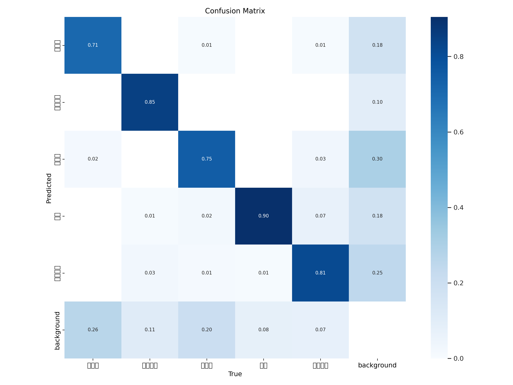

- 예측된 클래스와 실제 클래스 간의 관계를 시각화한 표입니다.
- 색이 진할수록 올바르게 분류된 비율이 높음을 의미합니다.
- 라벨 순서는 다음과 같습니다:
  - **비닐류, 유리병류, 종이류, 캔류, 페트병류, background**

---

### 📌 2. Precision-Recall Curve (정밀도-재현율 곡선)

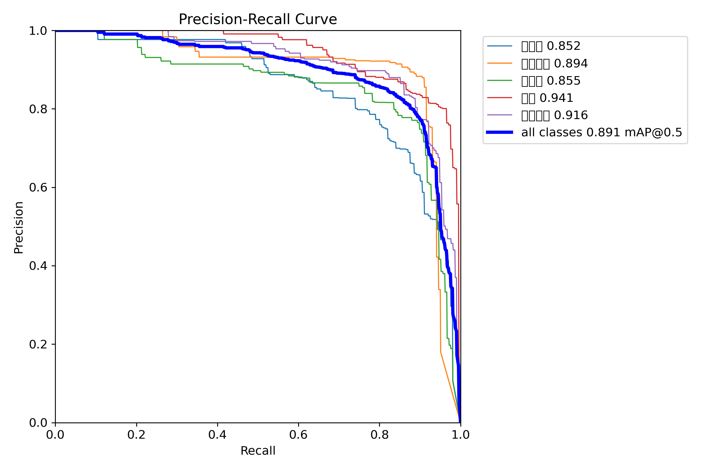

- 각 클래스별 정밀도(Precision)와 재현율(Recall)의 관계를 나타냅니다.
- 전체 클래스의 평균 mAP@0.5는 **0.891**로 우수한 성능을 보입니다.
- 라벨 순서:
  - **비닐류, 유리병류, 종이류, 캔류, 페트병류**

---

### 📌 3. 학습 과정 시각화 (Loss / Precision / Recall 등)

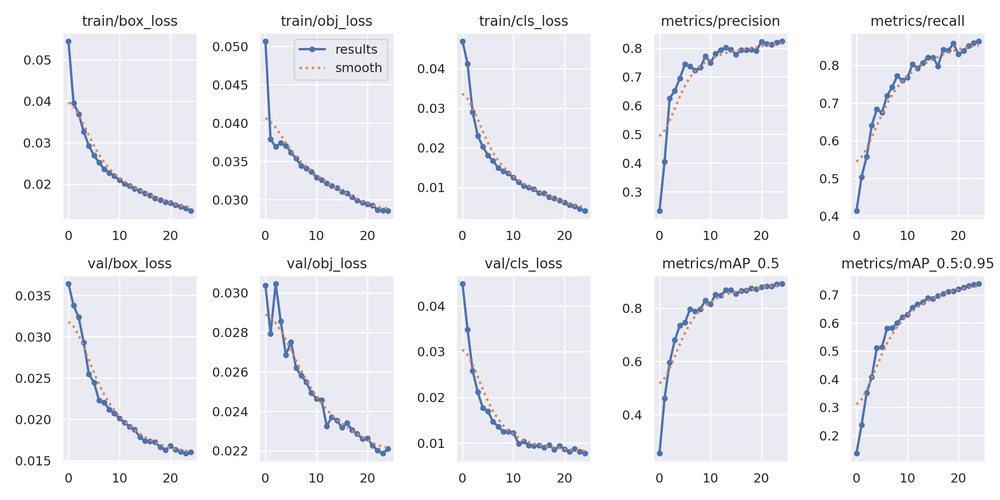

- 좌측부터 박스, 객체, 클래스 손실값이 지속적으로 감소하는 것을 확인할 수 있습니다.
- 우측 상단의 Precision / Recall 그래프에서 꾸준한 향상이 이루어진 점이 인상적입니다.
- 하단의 mAP 지표들도 안정적으로 상승해 **모델이 잘 수렴**되었음을 보여줍니다.

---

이 자료들은 `runs/train/trash_results3/` 경로에 위치하며, 모델 성능을 직관적으로 확인할 수 있도록 구성되어 있습니다.

## ✅ 결과 요약

- **정확한 분류**: 비닐류, 캔류, 유리병류
- **부정확한 분류**: 종이류, 페트병류 (형태 변화에 취약)
- **한계**: 객체가 여러 개인 경우 하나로 인식하는 오류

### 📸 분류 예시 결과

#### 🥫 캔류 예측

  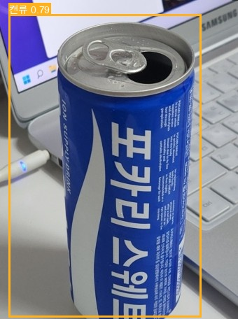
  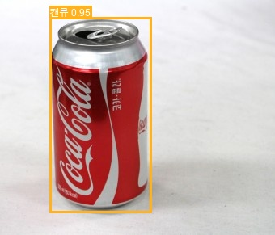

#### 🍾 유리병류 예측

  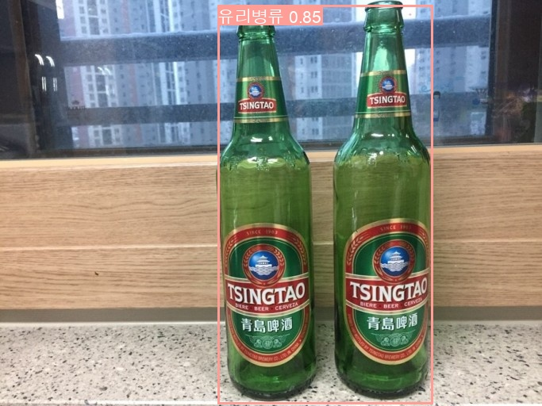
  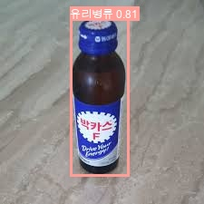

#### 🛍️ 비닐류 예측

  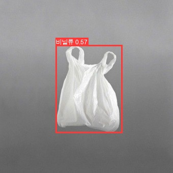
  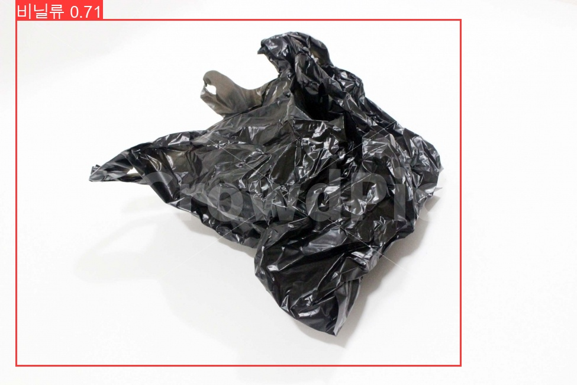

#### 📄 종이류 예측

  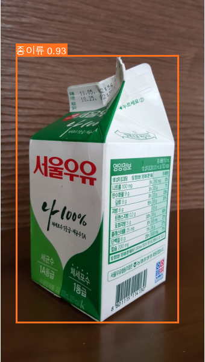

#### 🧴 페트병류 예측

  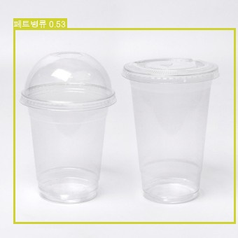

## 🔧 향후 개선 방향

- 다양한 형태의 쓰레기 이미지 추가 (구겨진 종이, 찌그러진 병 등)
- 다객체 인식이 가능한 구조로 모델 개선
- 전체 클래스(15종) 학습으로 확대

## 🗝️ 주요 키워드

`YOLOv5` `Object Detection` `Garbage Classification` `Recycling` `Computer Vision`
